# seathru-orca

A Python implementation of **Sea-thru** — the physically based underwater
colour-restoration method from:

> Derya Akkaynak and Tali Treibitz, **"Sea-thru: A Method for Removing Water
> From Underwater Images,"** *IEEE/CVF Conference on Computer Vision and
> Pattern Recognition (CVPR), 2019, pp. 1682–1691.*
> [Paper (CVF Open Access, PDF)](https://openaccess.thecvf.com/content_CVPR_2019/papers/Akkaynak_Sea-Thru_A_Method_for_Removing_Water_From_Underwater_Images_CVPR_2019_paper.pdf) ·
> [Project page](http://csms.haifa.ac.il/profiles/tTreibitz/webpage/sea-thru.html)

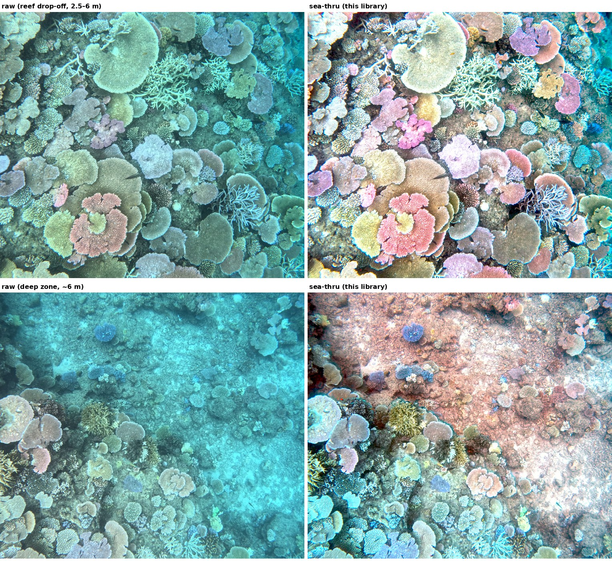

*Straight off an autonomous surface vehicle: GoPro frames from a 2,022-image
reef survey (left) and the same frames after this library's water removal
(right) — COLMAP metric depth patched with monocular inference, water-column
illuminant, one survey-locked calibration, no per-image tuning. Top: reef
drop-off spanning 2.5–6 m in a single frame. Bottom: the survey's deepest
zone (~6 m).*

Sea-thru was, as far as we're aware, the first method to treat underwater
image formation as a genuine physical inverse problem — recovering true scene
colour from a range map rather than applying a global dehazing-style
correction. It's an excellent piece of work, and this library exists to make
its ideas usable as an ordinary importable Python package. **This is an
independent, from-scratch re-implementation of the paper's equations and
underlying theory — not a copy of the authors' original code** (which is
research MATLAB, not published as a library). All credit for the method,
the physics, and the underlying research belongs to Akkaynak and Treibitz;
please cite their paper (see [Citing](#citing)) if you use this software.

This port was built for the [ORCA](.) autonomous-survey-vehicle reef-mapping
pipeline, to colour-correct large underwater photo datasets before
photogrammetry / Gaussian-splat reconstruction — but the library itself is
general-purpose and has no ORCA-specific dependency.

It recovers water-free colour from an RGB image **plus a per-pixel range
map**, using the paper's revised underwater image formation model (distinct
backscatter and direct-signal attenuation coefficients, range-dependent
attenuation).

## Contents

- [Why a range map matters](#why-a-range-map-matters)
- [The method, end to end](#the-method-end-to-end)
- [Novel contributions vs the original Sea-thru](#novel-contributions-vs-the-original-sea-thru)
- [Install](#install)
- [Pipeline: correcting a dataset](#pipeline-correcting-a-dataset)
- [Survey-locked mode](#survey-locked-mode)
- [Downward-looking surveys](#downward-looking-surveys-reefseabed-mapping)
- [Orthomosaic (GeoTIFF)](#orthomosaic-a-georeferenced-geotiff-straight-from-the-pipeline)
- [Configuration / tunable parameters](#configuration--tunable-parameters)
- [Time estimates](#time-estimates)
- [Large datasets (10k+ images) → COLMAP](#large-datasets-10k-images--colmap-on-a-laptop)
- [Tuning tools](#tuning-tools)
- [How it maps to the paper](#how-it-maps-to-the-paper)
- [Deviations from the paper](#deviations-from-the-paper-documented)
- [Limitations](#limitations)
- [Citing](#citing)

## Why a range map matters

Sea-thru is an **RGB-D** method: every pixel needs a distance-to-scene in
metres. This library makes the range map a pluggable input (`seathru.depth`):

| Source | Class | Needs | Quality |
| --- | --- | --- | --- |
| **COLMAP dense** | `ColmapDepthSource` | a COLMAP dense workspace (`stereo/depth_maps`) | **best** — metric, matches the paper's own method. See [docs/COLMAP_GUIDE.md](docs/COLMAP_GUIDE.md) |
| **Other SfM** | `FileDepthSource` | per-image depth maps exported from Metashape / ODM (`.npy`/`.tif`/`.png`) | best, if metric |
| **Monocular neural depth** | `MonocularDepthSource` | PyTorch (Depth Anything V2 / MiDaS) | good, approximate; scale anchored to `depth_m` |
| **Image-derived prior** | `EstimatedDepthSource` | nothing (red-attenuation cue) | rough but *spatially varying* — runs today with no torch/SfM; good for previews + parameter tuning |
| **Flat plane** | `PlaneDepthSource` | just a scalar altitude (or CSV `depth_m`) | coarse fallback — backscatter + white balance only |

With a *constant* plane the range term is degenerate, so plane mode does
backscatter removal + white balance only (the `f`/`l`/`p`/`epsilon` knobs have
**no effect**). Use SfM, monocular, or the image-derived prior for the full
range-varying colour recovery.

## The method, end to end

The complete processing chain, with each stage's origin marked —
**[paper]** = as published in Sea-thru (Akkaynak & Treibitz 2019),
**[mod]** = the paper's stage with a documented modification,
**[new]** = an addition of this library (see
[Novel contributions](#novel-contributions-vs-the-original-sea-thru)):

```text
RGB image (sRGB JPEG → inverse-gamma to ~linear)      [mod: paper uses linear RAW]
        │
        │      COLMAP dense depth  <name>.geometric/photometric.bin  (metres)
        │              │
        │              ├─ high-percentile clip (far MVS outliers)          [new]
        │              ├─ low-percentile clip (near-camera MVS junk)       [new]
        │              ├─ erosion trust filter (noise blobs in failed zones)[new]
        │              ├─ monocular patch: MiDaS + per-image affine
        │              │  alignment to the frame's own valid pixels        [new]
        │              └─ nearest-valid fill: interior always, border opt-in[new]
        ▼              ▼
  backscatter  B_c(z) = B∞(1−e^{−β_B z}) + residual   (Eq. 10, dark-pixel fit)
        │      per-frame by default; NOT locked across a survey            [paper+new]
        ▼
  iso-range neighbourhoods (Eq. 15)                                        [paper]
        ▼
  illuminant E_c:
     local space-average colour (Eq. 14)                                   [paper]
     ── or ──  water-column model  E_c(z) = e^{a_c + b_c z}                [new]
               b_c locked per survey, a_c fitted per frame                 [new]
        ▼
  attenuation β_D(z):
     two-term decaying exponential fit (Eq. 11)                            [paper]
     ── or ──  coarse form  β_D = −ln(E_c)/z  (Eq. 12) used directly       [mod]
        ▼
  recovery  J = (I − B) · e^{β_D z}   (Eq. 8)                              [paper]
        ▼
  white balance (Eq. 9; gains locked per survey)                           [paper+new]
        ▼
  robust contrast stretch (percentiles; bounds locked per survey)          [new]
        ▼
  saturation (uniform chroma gain; cosmetic, off by default)               [new]
        ▼
  sRGB PNG out  +  per-frame processing-path notes → end-of-run audit      [new]
```

Two operating regimes select between the `or` branches:

- **Horizontal/oblique imaging** (diver transects, forward-looking ROV — the
  paper's setting): use the paper defaults — local illuminant, two-term
  Eq. 11 fit, per-image adaptive statistics. This library reproduces the
  published method.
- **Downward (nadir) survey imaging** (ASV/drone seabed mapping): use
  `--attenuation-mode coarse --illuminant-mode water-column` plus
  survey-locked statistics — the configuration this library was built to get
  right, motivated and validated in
  [Downward-looking surveys](#downward-looking-surveys-reefseabed-mapping).

## Novel contributions vs the original Sea-thru

Everything in this section is an addition or correction relative to both the
2019 paper and the reference implementations of it, stated with the failure
that motivated it and the evidence behind it. All validation numbers come from
a 2,022-image ASV reef survey (GoPro, 1.5–5.6 m depth, COLMAP metric depth);
the depth-consistency metric is the recovered red/blue ratio of each frame's
deepest 15% of pixels versus its shallowest 25% (1.0 = the deep zone is as
water-free as the shallow zone), measured only where the raw red channel
carries signal above the sensor noise floor.

**1. Nadir-imaging failure analysis of the Eq. 11 attenuation fit, and the
`coarse` correction.** Eq. 2 of the paper is derived for horizontal imaging
and "applied to other directions assuming the deviations are small." For a
downward camera the deviation is not small: range ≈ depth, so deeper pixels
are lit by strongly red-depleted ambient light and the effective wideband
`β_D` **rises** with range — while Eq. 11 constrains `β_D(z)` to a sum of
*decaying* exponentials. The fit therefore produces an optical depth
`β_D(z)·z` that *decreases* with range (physically impossible — it claims
less total attenuation through more water), silently flattening the
correction exactly where the water column is thickest. Using the paper's own
Eq. 12 coarse estimate directly restores the correct monotonicity.
*Evidence:* depth-consistency 0.23 → 0.79 (→ ≈1.0 with the remaining
contributions); the "current vs coarse" gallery figures.

**2. A water-column illuminant model for nadir surveys.** The paper's
illuminant (Eq. 14, local space-average colour) embeds a *local gray-world*
assumption. Where the seabed is genuinely coloured (green algae rubble in
deep zones), the correction paints the zone with the complementary cast, and
because the correction is exponential in range the cast **grows with depth**
— measured as a red/green drift of **+0.11 /m** (deep yellow corals render
red). Modelling the illuminant instead as a per-channel exponential in range,
`E_c(z) = exp(a_c + b_c z)` (fit on binned medians, noise-floor pixels
excluded, extrapolated over the full valid range), makes the correction a
function of the *water column* rather than of local scene colour: two objects
at the same range receive identical treatment and relative colour is
preserved; natural shading survives. *Evidence:* R/G drift +0.11 → ≈0.0 /m;
best colour separation of all variants in the blind side-by-side review.

**3. Mixed-effects survey calibration (survey-locked mode).** For
orthomosaic/3DGS use, per-frame adaptive fitting is a liability: frame-to-
frame drift becomes seams and view-dependent colour flicker. This library
freezes the survey-wide statistics — white-balance gains, exposure-stretch
bounds, and the water-column **slope** `b_c` — from a calibration sample,
while deliberately keeping two things per-frame: the **backscatter** fit
(backscatter is intrinsically range-dependent; locking it re-introduced haze
on deep frames, 0.8 → 0.3) and the illuminant **intercept** `a_c` (a property
of the frame's auto-exposure/auto-white-balance; locking it passed camera
AWB drift into the output as whole-frame casts). The slope is pooled with a
*within-frame* (fixed-effects) estimator so between-frame exposure
differences cannot masquerade as depth attenuation. This split also removes a
silent failure mode: frames too flat to fit their own exponential previously
fell back to the local illuminant, producing abrupt washed-out ↔ saturated
flips between neighbouring frames.

Two estimator details proved essential. (a) The intercept is anchored to the
**direct signal** `I − B`, not to the local space-average illuminant: LSAC's
overall scale is chaotic on low-relief frames (its iso-depth neighbourhood
structure fragments when the depth span is tiny) — two near-identical frames
measured median-E 0.31 vs 0.51, a 60% output-brightness jump that locked
exposure can no longer re-normalise, rendering one frame blown-white. (b) The
intercept is a **pixel-weighted** median of `ln(I−B) − b·z`, not a median of
per-depth-bin medians: reflectance correlates with depth *within* a frame
(bright coral tops are shallow, dark crevices deep; per-bin medians span ~7×
in one frame), so bin-weighting lets minority crevice content swing the
frame's exposure. *Evidence:* neighbouring-frame chroma difference at the
flip boundary 0.02 → 0.008; the blown-white pair equalised (mean luminance
0.68/0.46 → 0.52/0.53); whole-survey QC 0/9 problem frames with mean output
luminance within 0.507–0.539 across the full depth range.

**4. MVS-depth hygiene for real dense-stereo output.** Sea-thru assumes a
clean range map; real `patch_match_stereo` output is not clean, and each
defect couples into the physics through `β = −ln(E)/z`:

- *Near-range junk* (spurious 0.2 m points on a 3 m reef) explodes `β` and,
  because the fit thins samples per range window, a handful of junk pixels
  can dominate it → low-percentile clip (`--colmap-clip-low`).
- *Noise blobs inside failed zones* (motion blur, texture-poor patches)
  survive global percentile clipping and are attached to the valid region
  by thin bridges, so a nearest-valid hole fill propagates garbage — one
  motion-blurred band was assigned 3.8–7.2 m against a 2.5 m rim,
  producing a saturated false-red band → erosion trust filter (erode the
  valid mask to cut bridges; trust only pixels near large surviving cores).
- *Large holes* are not rim continuations, so any propagation fill guesses
  wrong → **monocular patching** (`--colmap-fill-mono`): a monocular
  network's relative depth is aligned to the frame's own ~90% valid metric
  pixels by a robust per-image affine fit in inverse depth — the survey
  supervises itself, no training required. Median alignment residual on
  the failure frame: **0.10 m**; artefact eliminated.
- *Interior vs border* holes get different semantics (bounded
  interpolation always; extrapolation opt-in via `--colmap-fill-border`).

**5. A QC methodology for survey-scale correction.** Three cheap instruments
that catch failures before a multi-hour run: the **depth-consistency metric**
(above); a **recoverability scan** reporting the fraction of deep pixels
whose raw red sits below the sensor noise floor (no method can recover what
was never recorded — 8% of frames on the test survey are partially in this
regime, and knowing that beforehand prevents chasing unfixable frames); and a
**processing-path audit** — every frame logs which code path each component
took, with an end-of-run summary, so silent fallbacks are visible instead of
manifesting as unexplained odd-looking frames. `scripts/seathru_qc_variants.py`
packages the sample-first workflow (depth-spanning frame selection, named
variants, per-frame metrics).

**6. Cosmetic, declared as such:** a uniform post-recovery chroma gain
(`--saturation`) compensating the flatter look of physically-correct
attenuation removal (measured chroma 0.23 → 0.13 when the deep-water fix went
in). It is outside the physical model, applied identically to every frame,
and off by default.

Contributions 1–4 change *what is computed*; 5–6 change *how you operate it*.
For a journal write-up, the natural baseline comparisons are: stock Sea-thru
(paper defaults), + contribution 1, + 2, + 3, each scored with the metric of
contribution 5 on the same survey — the intermediate numbers above are exactly
that ablation.

## Install

Tested on Linux (Ubuntu) and Windows, Python 3.9–3.13 (monocular depth needs
Python ≤3.12, see below).

```bash
mkdir -p ~/seathru && cd ~/seathru
git clone https://github.com/<your-username>/seathru_python.git
cd seathru_python

python3 -m venv venv
source venv/bin/activate            # Windows: venv\Scripts\activate

pip install --upgrade pip
pip install -e .                    # core pipeline (numpy/scipy/scikit-image/pillow)
pip install -e ".[debug]"           # + matplotlib, for --debug intermediate-map montages

# Optional: monocular depth (--depth mono) AND monocular hole patching for
# COLMAP depth (--colmap-fill-mono, recommended for surveys). Needs a Python
# <=3.12 venv; use the CUDA index for GPU inference (~0.5 s/frame vs several
# s/frame on CPU). MiDaS additionally needs timm + OpenCV:
pip install torch torchvision --index-url https://download.pytorch.org/whl/cu121
pip install timm opencv-python-headless
```

Confirm it's installed:

```bash
python -m seathru.cli --help
```

## Pipeline: correcting a dataset

The general shape of a run is always the same:

```
input images  +  a depth source  +  (optional) survey CSV  -->  seathru  -->  corrected images
```

### 1. Lay out your data

```
my_survey/
├── images/                  # your source photos (JPEG/PNG/TIFF)
└── processed_images.csv     # optional: image_name,latitude,longitude,heading_deg,depth_m
```

The CSV is optional. If you have it, `depth_m` (camera altitude in metres) is
used to anchor/seed several depth sources; `-1` or a blank value is treated as
"unknown" and the source falls back sensibly.

### 2. Pick a depth source and run

No SfM, no GPU — good for a first look and for parameter tuning (uses the
spatially-varying red-attenuation prior, see the table above):

```bash
python -m seathru.cli \
    --input-dir my_survey/images \
    --out-dir   my_survey/seathru_out \
    --csv       my_survey/processed_images.csv \
    --depth estimated --est-near 1 --est-far 10
```

Flat-altitude fallback (fastest, backscatter + white balance only):

```bash
python -m seathru.cli --input-dir my_survey/images --out-dir my_survey/seathru_out \
    --csv my_survey/processed_images.csv --depth plane --plane-default 5
```

Per-image SfM depth maps exported from Metashape/ODM:

```bash
python -m seathru.cli --input-dir my_survey/images --out-dir my_survey/seathru_out \
    --depth file --depth-dir my_survey/sfm_depth --depth-scale 1.0
```

COLMAP dense depth (metric, best quality — see [the COLMAP guide](docs/COLMAP_GUIDE.md)
for taking a raw photo survey through SfM to get this):

```bash
python -m seathru.cli --input-dir my_survey/images --out-dir my_survey/seathru_out \
    --depth colmap --colmap-workspace my_survey/colmap/dense --full-res
```

> **Downward-looking surveys (reef/seabed mapping): add
> `--attenuation-mode coarse`.** See
> [Downward-looking surveys](#downward-looking-surveys-reefseabed-mapping) —
> the paper's default attenuation fit leaves deep water uncorrected on
> straight-down imagery, and `coarse` is the fix. The full recommended command
> for a reef survey is at the end of that section.

Monocular neural depth (needs torch, see [Install](#install)):

```bash
python -m seathru.cli --input-dir my_survey/images --out-dir my_survey/seathru_out \
    --csv my_survey/processed_images.csv --depth mono --mono-backend midas
```

Add `--full-res` to any of the above to estimate the correction at
`--max-size` (fast) but write the recovered image at the input's **native
resolution** (so it's 1:1 comparable and safe for downstream photogrammetry).

Each run writes `<name>_seathru.png` per input image, plus (with `--debug`)
`<name>_debug.png` intermediate-map montages for QA.

### 3. Use it as a library instead of the CLI

```python
from seathru import run_seathru, SeathruParams
from seathru.io_images import load_image, save_image
from seathru.depth import FileDepthSource, ImageMeta

img, _ = load_image("frame.jpg", max_size=1024)
depths = FileDepthSource("sfm_depth").get_depth(img, ImageMeta("frame.jpg"))
result = run_seathru(img, depths, SeathruParams(f=2.0, l=1.0))
save_image("frame_seathru.png", result.recovered)
```

## Survey-locked mode

By default (matching the paper), Sea-thru fits its backscatter, illuminant,
attenuation, and white-balance statistics **independently for every image**.
That's the right choice for a handful of photos, but across a
multi-thousand-frame survey it lets ambient light, turbidity, and colour
balance drift frame to frame — which shows up as visible seams when frames
are blended into an orthomosaic, and as view-dependent colour flicker when
training a NeRF/3D Gaussian Splat on the corrected frames.

**Survey-locked mode** freezes the per-image adaptive statistics across the
whole batch: it fits the backscatter (Eq. 10) and attenuation (Eq. 11)
coefficients and the white-balance gains (Eq. 9) *once*, from a handful of
frames spread evenly across the survey, then reuses that single frozen fit
for every image — each frame's own range map still drives where the
correction is strongest, only the water-column physics and colour balance
are shared.

```bash
python -m seathru.cli \
    --input-dir my_survey/images --out-dir my_survey/seathru_out \
    --csv my_survey/processed_images.csv \
    --depth colmap --colmap-workspace my_survey/colmap/dense --full-res \
    --survey-locked --calib-sample-size 20
```

What happens:
1. `seathru` samples 20 images spread evenly across the sorted file list
   (start/middle/end of the survey — different lighting, altitude, turbidity).
2. It fits the full per-image adaptive model on each of those 20 frames, then
   takes the **median** of the fitted coefficients across the sample (robust
   to one bad frame — e.g. texture-poor or badly exposed).
3. It saves the result to `my_survey/seathru_out/survey_stats.json` and
   reuses it for every image in the batch. **Re-running the same command
   later loads the saved JSON instead of recalibrating** — delete the file
   (or pass a different `--stats-file`) to force a fresh calibration.
4. Every image is then processed using the frozen coefficients, evaluated
   against *that image's own* depth map — this is also **faster** than
   adaptive mode, since the expensive nonlinear curve fits only run on the
   calibration sample, not on every image (see [Time estimates](#time-estimates)).

Notes:
- **Exposure/contrast is *not* locked by default** — each frame keeps its own
  percentile contrast stretch, because scene brightness legitimately varies
  with altitude and sun angle across a survey. Pass `--lock-exposure` to also
  freeze the output contrast-stretch bounds from calibration, if you need
  every frame on an identical absolute scale.
- With `--depth plane` (a constant range map), only the white-balance gain
  can be usefully locked — the code detects this automatically and leaves
  the backscatter/attenuation coefficients per-image (there's no spatial
  information to lock them from). No action needed on your part.
- `--calib-sample-size` trades calibration robustness for calibration time:
  each sampled frame costs one full adaptive-mode fit. 12–20 frames is a good
  default for a multi-thousand-image survey; smaller/simpler surveys can use
  fewer.
- Programmatically: `seathru.survey.calibrate_survey_stats(...)` returns a
  `seathru.core.SurveyStats`, and `SeathruParams(locked_stats=stats)` applies
  it to any `run_seathru(...)` call.

## Downward-looking surveys (reef/seabed mapping)

Sea-thru's image formation model (paper Eq. 2) is derived for **horizontal**
imaging and, as the paper states, "applied to other directions assuming the
deviations are small." For a **downward-looking** survey — an ASV/drone
mapping the seabed straight down — that assumption breaks, and the default
pipeline leaves the **deep parts of the scene full of water** (a reef dropoff
corrects beautifully in the shallows and stays blue/cyan at depth). Three
settings fix it; all are validated on a real 20×20 m reef survey spanning
1.5–5.6 m depth.

**1. `--attenuation-mode coarse` — the important one.** In horizontal imaging
every object is at roughly the same depth, so the ambient light is constant and
the direct-signal attenuation `β_D` genuinely *decays* with range. That is why
Eq. 11 fits `β_D(z)` as a sum of **decaying** exponentials (both exponents
constrained ≤ 0). Looking straight down, **range ≈ depth**, so deeper pixels sit
under markedly redder-depleted light and the true `β_D` *rises* with range. The
decaying two-term form cannot represent a rising function, so `refine_attenuation`
flattens the correction exactly where the water column is thickest — the optical
depth `β_D·z` comes out *decreasing* with range, which is physically impossible.
`--attenuation-mode coarse` skips that fit and uses the illuminant-derived
`β_D = −ln(illuminant)/z` (Eq. 12) directly, which correctly rises with range.
On the test reef this moved the deep-vs-shallow red/blue consistency from
**0.23 (deep still full of water) to ~0.9 (deep as corrected as shallow)**.

**2. `--colmap-clip-low 2.0` (on by default for `--depth colmap`).** MVS emits a
few spurious near-camera points (e.g. 0.2 m on a reef imaged from 3 m). Because
`β = −ln(illuminant)/z`, a tiny `z` explodes `β`, and those handful of junk
pixels get outsized weight in the attenuation fit — enough on their own to drag
even the coarse estimate the wrong way. Dropping the lowest ~2% of depths per
image removes them.

**3. Survey-locked: use `--no-lock-backscatter`.** Backscatter
`B = veiling·(1 − e^{−β_bs·z})` is *intrinsically range-dependent*. Freezing one
median backscatter across a survey (the default `--survey-locked`) under-subtracts
veiling light on the deep frames and re-introduces the blue haze — on the test
set it regressed deep frames from ~0.8 back to ~0.3. White-balance gains, by
contrast, are safe (and useful) to lock for cross-view colour consistency. So on
a depth-varying survey, **lock white-balance and exposure but keep backscatter
per-image**: pass `--survey-locked --lock-exposure --no-lock-backscatter`.

**4. `--illuminant-mode water-column` — best colour fidelity at depth.** The
paper's illuminant (Eq. 14) is a *local space-average colour*: it normalises
local shading, but embeds a local gray-world assumption. Where the seabed is
genuinely coloured (green algae rubble in a deep zone), that assumption paints
the whole zone with the complementary cast — and because the correction is
exponential in range, the cast grows with depth: yellow/orange objects visibly
redden the deeper they sit. `water-column` mode instead fits the illuminant as
a per-channel exponential in range, `E_c(z) = exp(a_c + b_c z)` — robustly
(binned medians, sensor-noise-floor pixels excluded) and extrapolated over the
full valid range so the deepest pixels keep getting the full correction.
Objects at the same range then receive **identical** correction, so their
relative colours are preserved, and natural shading survives in the output.
On the test reef this gave the best colour separation of every variant tried
(see the gallery below).

With `--survey-locked`, the water-column **slope** `b_c` is calibrated once
from the whole survey (pooled *within-frame* estimator, so auto-exposure
differences between frames can't masquerade as depth attenuation) and reused
for every frame, while the **intercept** `a_c` stays per-frame. That split
matters: the slope is a property of the water — identical everywhere in the
survey — so flat frames without enough depth relief to fit their own
exponential no longer silently fall back to the local illuminant (which showed
up as an abrupt washed-out ↔ saturated flip between neighbouring frames); and
the intercept is a property of the frame (auto-exposure / auto-white-balance
drift), so locking *it* would pass camera AWB drift straight into the output
as whole-frame colour casts. Validated: 0/7 problem frames on the QC set
including the deepest frame, the flattest run, and a dropoff-tail frame that
per-frame fitting under-corrected.

**5. Depth-map hygiene: hole filling** (`--depth colmap`). MVS leaves invalid
holes — speckle, moving fish, texture-poor patches — and a pixel without depth
gets **no correction at all**, surviving as a raw hazy patch in an otherwise
corrected frame. `--colmap-fill-holes` (default on, up to 2% of image area)
fills *interior* holes with the nearest valid depth — bounded interpolation,
enclosed by real measurements. Border-touching gaps (the undistortion frame,
edge strips where the first/last frames lack a matching neighbour) are
*extrapolation* and opt-in via **`--colmap-fill-border`**: enable it when every
pixel of every frame should be corrected (feeding photogrammetry / 3DGS
texturing); leave it off if you prefer honest invalid edges that overlapping
frames cover downstream.

Two hardening layers make the filling trustworthy on real MVS output:

- **Erosion trust filter** (on by default). A zone where MVS failed is rarely
  100% invalid — it contains blobs of "valid" pure-noise depth attached to the
  real region by thin bridges, and a nearest-valid fill will happily propagate
  that garbage (observed: a motion-blurred band assigned 3.8–7.2 m against a
  2.5 m rim → a strong false red band). Before filling, the valid mask is
  eroded to cut the bridges, only large surviving cores are trusted, and
  untrusted "valid" pixels are discarded.
- **`--colmap-fill-mono` — monocular neural patching (recommended; needs
  torch).** For *large* holes the true surface is often not a continuation of
  the rim at all, so any propagation-based fill guesses wrong. This runs a
  monocular depth network (MiDaS by default) on the frame and aligns its
  relative output to the ~90%+ of valid metric COLMAP pixels with a per-image
  robust affine fit in inverse depth — no training needed; the survey's own
  depth is the supervision. On the red-band test frame the aligned mono patch
  matched the COLMAP overlap to **0.10 m** median error and fully removed the
  artefact. Costs ~0.5 s/frame on a modest GPU after model load.

**6. `--saturation` — colour punch.** Physically-correct attenuation removal
tends to look flatter than the eye expects: measured chroma dropped from ~0.23
to ~0.13 on the test reef when the deep-water fix went in ("the reds aren't as
red, the yellows aren't as yellow"). A post-recovery chroma gain of **1.4–1.6**
restores it without touching the water model; it is applied uniformly, so
survey-wide colour consistency is preserved.

**Recommended command for a downward reef/seabed survey** (the full validated
recipe):

```bash
python -m seathru.cli \
    --input-dir my_survey/colmap/dense/images \
    --out-dir   my_survey/seathru_out \
    --csv       my_survey/processed_images.csv \
    --depth colmap --colmap-workspace my_survey/colmap/dense \
    --colmap-depth-kind photometric \
    --colmap-clip-low 2.0 --colmap-fill-holes 0.02 --colmap-fill-border \
    --colmap-fill-mono \
    --attenuation-mode coarse --illuminant-mode water-column \
    --l 1.0 --f 2.4 --saturation 1.6 --full-res \
    --survey-locked --lock-exposure --no-lock-backscatter --calib-sample-size 20
```

Every run prints a per-frame note of which processing path each component took
(`illum: wc-locked-slope`, `mono-filled 13.1%`, fallbacks, …) and ends with a
**processing-path summary** — a count of frames per path. Read it before
trusting the output: an unexpected fallback entry there is the first clue when
a handful of frames come out looking different from their neighbours.

### Validation gallery (2022-image reef survey, 1.5–5.6 m depth)

How the corrections were arrived at, shown on real frames. Each improvement
was validated on depth-spanning sample frames *before* committing to full
survey runs (`scripts/seathru_qc_variants.py` automates exactly this
workflow — use it).

**Why hole filling matters** — pixels without depth are left at their raw
colour. Left→right: raw frame; COLMAP depth (89.5% valid); valid/invalid mask;
recovered frame with **magenta marking still-blue pixels (14.9%)** — the
uncorrected patches track the missing depth almost exactly:

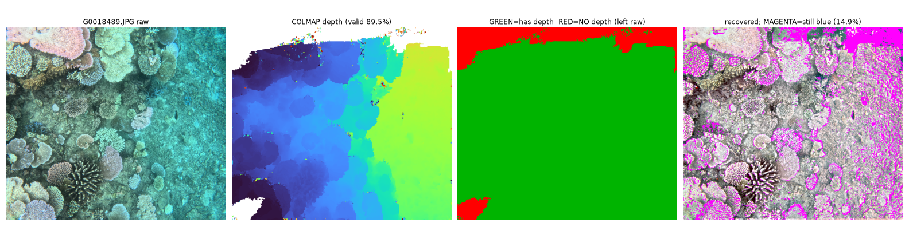

**Fill levels compared** — default small-speckle fill, interior fill, and full
border extrapolation (`--colmap-fill-border`, right: 100% valid, every pixel
corrected — note the top-edge strip present in the middle tiles is gone):

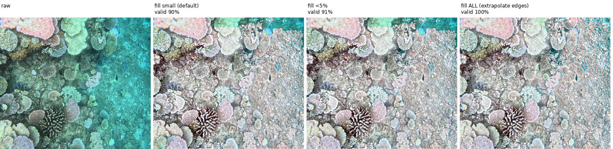

**When propagation filling isn't enough — and how monocular patching fixes
it.** This frame's bottom band is motion-blurred, so MVS failed there — but
not cleanly: the failed zone contains blobs of "valid" pure-noise depth
(2–7.2 m, against a 2.5 m reef) that survive global percentile clipping.
Nearest-valid filling propagated from those blobs, assigning deep-water
ranges to bright blurry content, and the deep-level red boost turned the
whole band into a saturated false-red stripe:

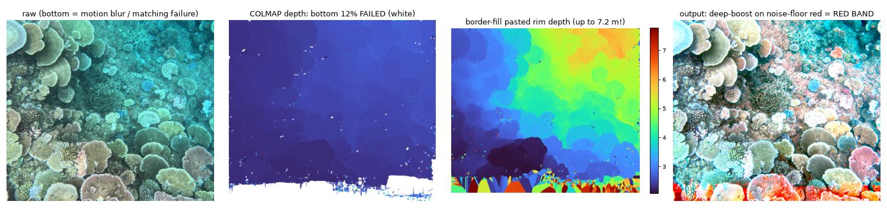

The fix, in two layers, validated on the same frame below: the **erosion
trust filter** (middle column) cuts the thin bridges attaching noise blobs to
the real region and discards them, which removes most of the band; adding
**`--colmap-fill-mono`** (right column) patches the hole with MiDaS monocular
depth aligned per-image to the frame's own valid COLMAP pixels — the aligned
patch matched the overlap to **0.10 m** median error, the band's depth becomes
a smooth 2.3 m continuation of the reef, and the red stripe disappears from
the output entirely:

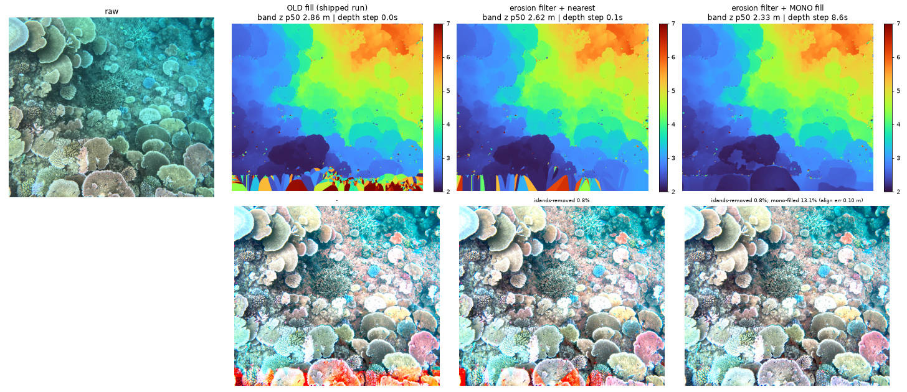

**Illuminant mode on a deep frame with healthy red signal** (6.3 m, ~6% of
deep pixels at the noise floor). Water-column mode (third column) clears the
cyan completely *and* keeps the yellow colony yellow, the pink plates pink,
the purple coral purple — where the local-illuminant reference (second column)
renders a flatter beige. Raising `l` past 1.0 (fourth column) over-reddens:

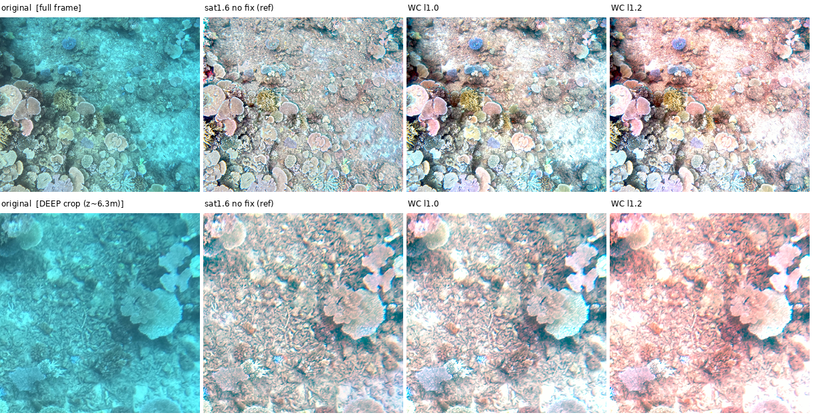

**The physical limit, honestly** — same comparison on a frame whose deep zone
is 70–85% *below the sensor noise floor* (raw red < 0.02). No method can
recover colour that was never recorded: the local-illuminant reference hides
those dead pixels under a false salmon-pink cast; water-column mode corrects
everything with real signal and leaves the dead pixels visibly cyan. Prefer
the honest rendering — and know your survey's dead-red fraction *before* a
full run (the QC script reports it; this survey: 92% of frames in good shape):

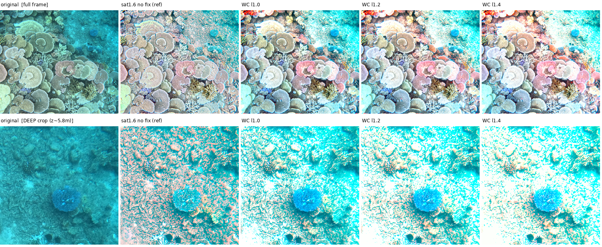

**Exposure stability between neighbouring frames — the estimator matters.**
Sea-thru's per-frame contrast stretch silently re-normalises every frame's
exposure; locking exposure for survey consistency removes that safety net, so
any instability in the illuminant's overall scale prints straight into output
brightness. Below: two consecutive frames of the *same* reef patch (raw means
within 4%, depth within 0.01 m) processed with an early intercept estimator —
the local-space-average illuminant's scale, aggregated by depth-bin medians.
The model illuminant `E` (third column) comes out **2.2× apart** on
near-identical inputs, and the brighter-boosted frame blows out white (45% of
pixels >0.95 vs 11%):

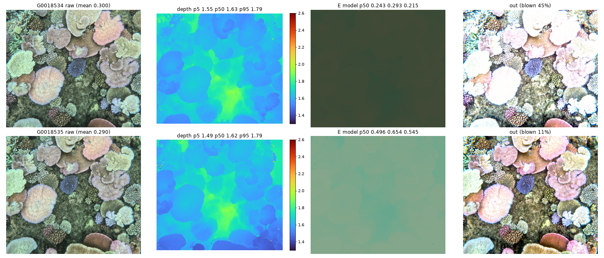

Same two frames after anchoring the intercept to the **direct signal** `I − B`
and aggregating with a **pixel-weighted** median of `ln(I−B) − b·z` (per-bin
medians span ~7× within one frame because bright coral tops sit shallow and
dark crevices deep — bin-weighting lets that minority content set the frame's
exposure). `E` now agrees within 8% and the outputs match at mean luminance
0.525 vs 0.532:

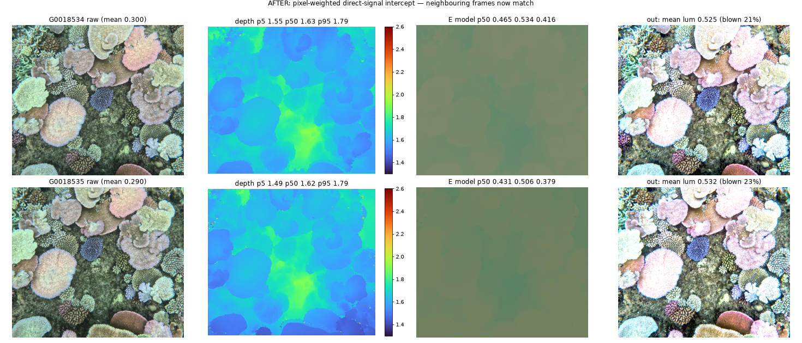

The same estimator is used at calibration and at apply time, which is what
pins the whole survey's output luminance into 0.507–0.539 (measured over the
QC set spanning 1.5–5.6 m). Note both figures here are at `f = 2.0`; the
consistency fix and the exposure *level* are orthogonal — the final recipe
uses `--f 2.4`, which lowers the matched pair to ~10% blown highlights (the
preferred look) while leaving the frame-to-frame agreement untouched.

### Results (full 1939-image run with the recipe above)

Raw vs corrected across the survey's whole depth range — same recipe, one
frozen calibration, no per-image tuning:

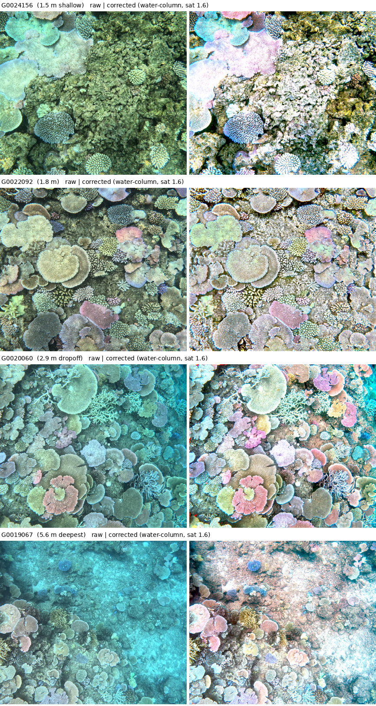

Quantified over an 78-frame sample of the output (deep = deepest 15% of each
frame's pixels, measured where the raw red channel carries real signal):

| Metric | Result |
| --- | --- |
| Deep-pixel red/blue ratio (1.0 = neutral, water fully removed) | p50 **0.94** (p10 0.63, p90 1.07) |
| Deep vs shallow colour consistency | p50 **0.93** |
| Frames with residual water in the deep zone (deep R/B < 0.5) | **0** / 78 |
| Frames with red/pink over-correction (deep R/B > 1.3) | **0** / 78 |
| Throughput (full-res survey-locked, 1 core, Ryzen 5800H) | ~6.5 s/image → ~3.5 h for 1939 |

For comparison, the unmodified pipeline (two-term fit, local illuminant) on
the same survey scored **0.23** deep-vs-shallow consistency — the deep half of
every dropoff frame stayed blue. The remaining honest limits: pixels whose raw
red sits below the sensor noise floor render neutral-cyan rather than
recovering colour (~8% of frames have a substantial such zone on this survey),
and frames whose depth distribution is dominated by a shallow majority can
under-correct their small deep tail (~1 in 6 dropoff-type frames, visible as
residual cyan at the very deepest edge).

> **`l` on a reef survey:** with `coarse` mode the paper default `--l 1.0` is
> right. Do **not** reflexively lower `l` to fix over-brightness on shallow
> frames — it starves the deep correction; and raising it past ~1.15 tips the
> deep pixels into a pink/red over-correction. Tune it with the QC harness
> ([tuning tools](#tuning-tools)) on depth-spanning frames, not a single shallow
> one.
>
> **Physical limit:** where the raw red channel is already at the sensor noise
> floor (very deep, turbid, or strongly red-absorbing water), no method can
> recover colour — there is no signal to amplify. `scripts/seathru_qc_variants.py`
> reports the fraction of a survey that is in this regime so you know what to
> expect before a full run.

## Orthomosaic: a georeferenced GeoTIFF straight from the pipeline

Once a survey is corrected, an orthomosaic needs **no further photogrammetry**
— the poses and the metric surface already exist. `scripts/build_orthomosaic.py`
streams each corrected frame, back-projects every pixel to the seafloor
through its own COLMAP depth map, keeps the highest-elevation sample per
ground cell (top-of-coral wins — correct occlusion handling for nadir
imagery), and writes a tiled, compressed GeoTIFF in the survey's UTM zone,
ready to drop into QGIS:

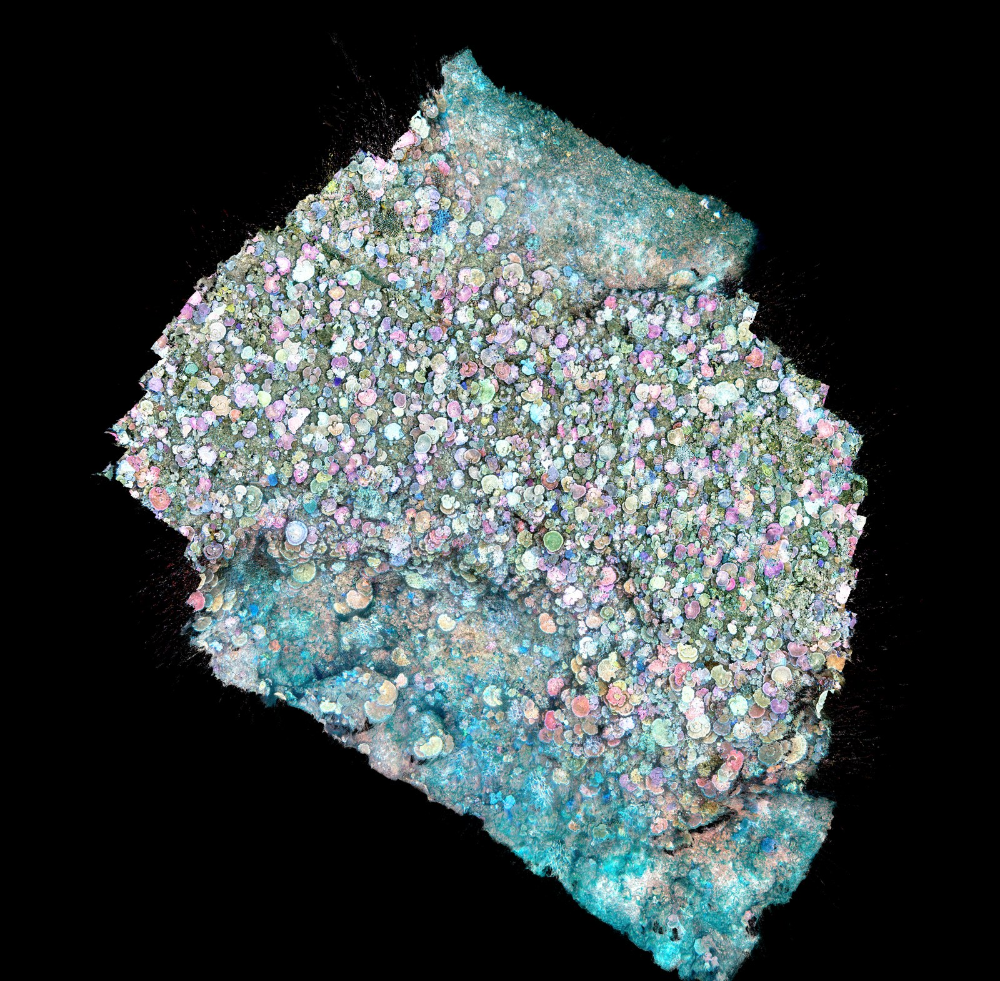

*The full 2,022-frame test survey as a single orthomosaic: 10,200 × 10,015 px
at 3 mm/px (~20 × 20 m of reef), EPSG:32755, built in **30 minutes** on one
CPU core at ~1 s/frame with <1 GB of RAM. Survey-locked colour means the
strips join without feathering or seam blending.*

```bash
python scripts/build_orthomosaic.py \
    --corrected-dir my_survey/seathru_out \
    --colmap-workspace my_survey/colmap/dense \
    --csv my_survey/processed_images.csv \
    --out my_survey/orthomosaic.tif \
    --gsd 0.003
```

Notes:

- **No matching, no heading, no neighbour selection** — those concerns belong
  to SfM, which is already done. Poses encode full orientation; RAM and CPU
  are bounded by construction (one frame in memory + the output grid).
- Pick `--gsd` near your imagery's native ground footprint (`altitude / focal
  length in px` — ~2.5 mm for a GoPro at 1.7 m); halving GSD quadruples grid
  RAM but changes nothing else.
- Depth-outlier hygiene is on by default and matters at strip edges:
  `--border-trim 15` (MVS depth is least reliable at frame borders),
  `--max-view-z 8` (rejects implausibly far samples — the "radial spike"
  artefact), and an elevation sanity band (`--elev-min/--elev-max`).
- `--subsample N --pixel-stride M` give quick previews (a 1 cm preview of the
  full survey takes ~3 minutes).
- For a **DEM/mesh product** (rugosity, contours), pair the corrected images
  with a full photogrammetry suite (MicMac, OpenDroneMap, Metashape) — but
  for the orthomosaic itself, reusing the pipeline's own depth is faster by
  orders of magnitude and inherits the mono-patched, hygiene-filtered depth.

## Configuration / tunable parameters

All tunable knobs live in one place: `seathru.core.SeathruParams` (mirrored
1:1 by `seathru.cli`'s flags). The dataclass docstring in
[`seathru/core.py`](seathru/core.py) is the canonical reference; summary:

| Param | CLI flag | Default | Effect |
| --- | --- | --- | --- |
| `p` | `--p` | `0.5` | Illuminant locality (Eq. 14 support weight, 0–1). Higher trusts the local pixel over its neighbourhood average. |
| `f` | `--f` | `2.0` | Illuminant geometry factor (paper uses 2). In water-column mode this is the **exposure dial**: it sets how far above scene radiance the model illuminant sits, i.e. how much signal saturates *before* the clip. Higher = darker output with more highlight detail (`2.0` ≈ 20% blown highlights on the test reef, `2.4` ≈ 10% — the validated pick, `2.8` ≈ 3–5%). Because the clipped-highlight mass anchors the locked stretch bound near 1.0, changing `f` is **not** cancelled by recalibration. |
| `l` | `--l` | `1.0` | Attenuation/brightness balance — **the main strength dial**. Lower if far/deep areas over-brighten — **but not on a downward survey**, where lowering it starves the deep correction (see [Downward-looking surveys](#downward-looking-surveys-reefseabed-mapping)). |
| `attenuation_mode` | `--attenuation-mode` | `two-term` | `two-term` = paper Eq. 11 decaying fit (horizontal imaging). `coarse` = illuminant-derived `β_D` (Eq. 12); **required for downward-looking surveys**. |
| `illuminant_mode` | `--illuminant-mode` | `local` | `local` = paper Eq. 14 local space-average. `water-column` = per-channel exponential fit in range; preserves relative object colour on downward surveys (see above). |
| `saturation` | `--saturation` | `1.0` | Post-recovery chroma gain. `1.4–1.6` restores the punch that physically-correct removal flattens; uniform, so survey-consistent. |
| `hue_depth_flatten` | `--hue-depth-flatten` | `0.0` | Strength (0–1) of a self-calibrating depth-hue trend removal, pivoted at the shallow end. Tested but **not** part of the recommended recipe — `water-column` addresses the cause rather than the symptom. |
| `epsilon` | `--epsilon` | `0.05` | Iso-range neighbourhood band width (Eq. 15), fraction of the scene's depth span. |
| `protect_red` | `--no-protect-red` to disable | `True` | White-balance red gently instead of pure Gray-World (avoids pink cast on red-starved deep frames). |
| `stretch_pct` | `--stretch-low` / `--stretch-high` | `(0.5, 99.5)` | Output contrast-stretch percentiles. Widen toward `(0.1, 99.9)` for a flatter, safer result; tighten for more punch. |
| `backscatter_restarts` | `--backscatter-restarts` | `25` | Random-restart count for the Eq. 10 fit. Dominates per-image runtime — lower for speed, raise for a harder scene. |
| `attenuation_restarts` | `--attenuation-restarts` | `10` | Random-restart count for the Eq. 11 fit. Also runtime-dominant. |
| `min_neighborhood` | — (library only) | `50` | Minimum neighbourhood pixel count before it's merged into its nearest survivor. |
| `spread_fraction` | — (library only) | `0.01` | Sample-thinning window for the attenuation fit. |

> `p`, `f`, `l`, `epsilon` only take effect with a **spatially varying** range
> map (SfM, monocular, or the image-derived prior). On a flat plane they do
> nothing — only `stretch_pct` and `protect_red` are active.

Use the [tuning tools](#tuning-tools) below to pick working values on your
own imagery before committing to a full run.

## Time estimates

Sea-thru is CPU-bound pure NumPy/SciPy — the dominant cost is the nonlinear
curve fits (`backscatter_restarts` × 3 channels + `attenuation_restarts` × 3
channels) at your `--max-size` working resolution; everything is
single-threaded per image and needs no GPU.

Measured on a laptop CPU (**AMD Ryzen 7 5800H, 8C/16T, single-threaded per
image**), default parameters, spatially-varying depth (the full-cost path —
`--depth plane` is noticeably cheaper, see below). These are real
`run_seathru` timings from this repo's own benchmark, not estimates:

| Working resolution (`--max-size`, long edge) | Adaptive mode (per image) | Survey-locked mode (per image, after calibration) | Speedup |
| --- | --- | --- | --- |
| 512 px  | 8.1 s  | 0.15 s | 54× |
| 1024 px (default) | 28.4 s | 0.62 s | 46× |
| 1600 px | 70.2 s | 1.8 s  | 39× |
| 2048 px | 118.5 s | 2.8 s | 42× |

Survey-locked mode is faster as well as more consistent: it skips the
nonlinear backscatter/attenuation curve fits entirely for every image except
the calibration sample, evaluating the already-fitted coefficients against
each frame's own depth map instead.

`--full-res` adds a fixed upsample+recover pass at native resolution on top
of the `--max-size` estimate above. Measured estimate@1024 (adaptive) →
apply@5568×4872 (a full-resolution GoPro frame): 29.2 s + 4.8 s = **34.1 s**
per image total; with survey-locked mode the estimate step drops to ~0.6 s,
so the full-res total becomes **~5.4 s per image** (upsample+recover is the
same regardless of locked/adaptive).

`--depth plane` skips the spatial backscatter/attenuation fit entirely
(flat-plane recovery is backscatter-percentile + white balance only), so it
is roughly as fast as survey-locked mode regardless of resolution.

### Estimating a full dataset

```
total_time ≈ images × per_image_time / parallel_workers
```

**Worked example — 10,000 images, `--max-size 1024` (the default), single core:**

- Adaptive mode: 10,000 × 28.4 s ≈ 284,000 s ≈ **~79 hours (~3.3 days)**
- Survey-locked mode: 10,000 × 0.62 s ≈ 6,200 s ≈ **~1.7 hours**
  (plus a one-off calibration pass — 12–20 images at the adaptive-mode cost,
  a few minutes — not repeated on re-runs since the stats JSON is cached)

**Same 10,000 images with `--full-res` (native-resolution output):**

- Adaptive mode: 10,000 × 34.1 s ≈ **~95 hours (~4 days)**
- Survey-locked mode: 10,000 × ~5.4 s ≈ **~15 hours**

`seathru` itself processes one image at a time, but nothing about the design
is stateful across images (survey-locked mode's shared state is just the
saved JSON), so you can trivially parallelise across CPU cores by splitting
`--input-dir` into N chunks and running N processes (e.g. with GNU `parallel`
or a simple shell loop), or by writing a small driver that calls
`seathru.pipeline.process_folder` per chunk with `multiprocessing`. On an
8-core laptop this divides the wall-clock estimates above by roughly 6–8×.

For reference, `hw_profile.py` in `scripts/` detects this machine's CPU/RAM/GPU
(used for tuning the COLMAP stage, see below) and is a reasonable place to
add a similar `seathru`-specific worker-count heuristic if you want one.

## Large datasets (10k+ images) → COLMAP on a laptop

For a full survey (e.g. 10,000+ images, tens of GB), see
**[docs/COLMAP_GUIDE.md](docs/COLMAP_GUIDE.md)**. It covers install, folder
setup, GPS/time-limited matching (so it fits in laptop RAM), **chunked mapping
you can pause and resume across nights / power-offs**, georegistration to
metres, dense depth, and feeding the result back into `--depth colmap`. Helper
scripts in `scripts/`:

- `hw_profile.py` — detect CPU/RAM/GPU (or `--profile laptop|workstation|hpc`) and
  emit a `pipeline.env` of COLMAP tuning params, so the *same* workflow scales
  from a laptop to an HPC node.
- `colmap_geo_from_csv.py` — CSV GPS → georegistration file + image list.
- `colmap_make_pairs.py` — GPS/time neighbour match-pairs (bounds CPU/RAM).
- `colmap_make_chunks.py` — split into overlapping chunks for resumable mapping.

The guide is hardware-adaptive and includes a **SLURM section** (Apptainer +
job-array chunked mapping) for running COLMAP on university HPC.

## Tuning tools

Three scripts in `scripts/` help you pick a working point before committing to a
full run. All default to the **image-derived depth prior** so the `f`/`l`/`p`/`epsilon`
knobs are active (a flat plane leaves them inert), and all cache a fixed image
sample so runs stay comparable.

| Script | Answers | Output |
| --- | --- | --- |
| `param_effect_grid.py` | *What does each knob do?* — every parameter swept low→rec→high, one row each | one sheet per image (`_params.png`) |
| `param_grid_2d.py` | *How do two knobs interact?* — one parameter across columns, another down rows | `_<x>_x_<y>.png` |
| `sample_test.py` + `compare_grid.py` | *Is one setting consistent across scenes?* — a tagged run over the same N images, compared side-by-side | `comparison_grid.png` |

```bash
# 1. Learn the knobs on one scene (every parameter, isolated)
python scripts/param_effect_grid.py --input-dir my_survey/images \
    --csv my_survey/processed_images.csv \
    --out-dir my_survey/seathru_param_effects --image example.jpg

# 2. Find the sweet spot between two knobs (e.g. f vs l)
python scripts/param_grid_2d.py --input-dir my_survey/images \
    --csv my_survey/processed_images.csv \
    --out-dir my_survey/seathru_param_effects --image example.jpg \
    --x-param f --x-values 1.5,2,2.5,3 --y-param l --y-values 0.5,1,1.5

# 3. Confirm your chosen setting holds across a random sample, then iterate tags
python scripts/sample_test.py --input-dir my_survey/images \
    --csv my_survey/processed_images.csv \
    --out-dir my_survey/seathru_sweep --n 10 --seed 42 --tag baseline
python scripts/sample_test.py --input-dir my_survey/images --csv my_survey/processed_images.csv \
    --out-dir my_survey/seathru_sweep --tag l0.5 --l 0.5
python scripts/compare_grid.py --out-dir my_survey/seathru_sweep
```

Note: the estimated prior tends to exaggerate the near/far range spread, so the
best `l` under it is usually **lower** than under metric COLMAP depth — re-check
`l` once real depth maps are in. Validate the pipeline quantitatively any time
with `python scripts/synthetic_validation.py` (paper's Eq. 18 angular-error
metric on a synthetic scene).

## How it maps to the paper

| Stage | Paper | Code |
| --- | --- | --- |
| Dark-pixel candidates in 10 range bins | §4.3 | `find_backscatter_points` |
| Backscatter fit `B = B∞(1−e^−βz) + J'e^−β'z` | Eq. 10 | `estimate_backscatter` |
| Iso-range neighbourhoods | Eq. 15 | `construct_neighborhood_map` |
| Local-space-average-colour illuminant | Eq. 13–14 | `estimate_illumination` |
| Coarse `β_D = −log(illuminant)/z` | Eq. 12 | `coarse_attenuation` |
| Two-term-exponential `β_D(z)` refined to range map | Eq. 11, 16–17 | `refine_attenuation` (`mode="two-term"`; `mode="coarse"` skips it for downward surveys) |
| Recover `J = (I−B)·e^{β_D·z}` + white balance | Eq. 8–9 | `recover_image` |

## Deviations from the paper (documented)

- **Inputs are 8-bit sRGB JPEG**, inverse-gamma'd to approximate linear
  radiance. The paper uses linear RAW; a RAW path is stubbed in `io_images`.
- **Illuminant** uses the fast neighbourhood-mean form of local space average
  colour (as in reference implementations of the paper) rather than the full
  per-pixel iterative diffusion — same intent, much faster.
- Photofinishing (§4.5, camera-pipeline colour-space conversion) is out of
  scope; output is a display-ready sRGB PNG.
- **Survey-locked mode** (see above) has no equivalent in the paper — it's an
  addition for processing large, consistently-lit photo surveys where
  per-image adaptivity is a liability rather than a feature. It's opt-in
  (`--survey-locked`); the default behaviour matches the paper.
- **`--attenuation-mode coarse`** (see [Downward-looking
  surveys](#downward-looking-surveys-reefseabed-mapping)) replaces the Eq. 11
  two-term fit with the Eq. 12 coarse `β_D` for straight-down imaging, where the
  paper's horizontal-imaging assumption makes the decaying two-term form fit the
  wrong sign of range dependence. Opt-in; the default (`two-term`) matches the
  paper.
- **`--illuminant-mode water-column`** replaces the paper's local space-average
  illuminant (Eq. 14) with a per-channel exponential fit in range. The local
  form embeds a local gray-world assumption that mis-colours genuinely
  non-gray zones, with an error that grows with depth (deep yellows turn red).
  Opt-in; the default (`local`) matches the paper.
- **`--saturation`** is a post-recovery chroma gain (not in the paper) — the
  physically-correct output tends to look flatter than expected; this restores
  it uniformly without touching the water model.
- **`--no-lock-backscatter`** and the `--depth colmap` MVS-depth hygiene flags
  (`--colmap-clip-low`, `--colmap-fill-holes`, `--colmap-fill-border`, the
  erosion trust filter, and `--colmap-fill-mono` monocular hole patching) are
  additions for real SfM depth, not part of the paper.
- **Survey-locked water-column slope** (with per-frame intercept) and the
  per-frame **processing-path log / end-of-run summary** are additions for
  large-survey consistency and auditability.
- **`--hue-depth-flatten`** (off by default) is an experimental self-calibrating
  depth-hue trend removal, kept for surveys where `water-column` mode is not
  applicable; it treats the symptom the illuminant mode fixes at the source.

## Limitations

Stated plainly, because they bound what any write-up can claim:

- **The sensor noise floor is a hard physical limit.** Where the raw red
  channel recorded ≈0 (deep, turbid, or strongly red-absorbing water), there
  is no signal to amplify: those pixels render neutral-cyan rather than
  recovering colour, and *no* post-hoc method can do otherwise. On the test
  survey ~8% of frames had a substantial such zone (72–85% dead red in the
  worst two). The recoverability scan quantifies this per survey **before** a
  run. Shooting RAW, brighter/slower exposures, or artificial lighting are
  the only real fixes.
- **Inputs are 8-bit sRGB JPEG**, inverse-gamma'd to approximate linear
  radiance. The paper's results use linear RAW; JPEG tone-mapping and 8-bit
  quantisation of dark red values compound the noise-floor problem above. A
  RAW path is stubbed but untested.
- **The water-column illuminant assumes one water body per survey** (a single
  `E_c(z)` slope). Surveys crossing strong turbidity gradients, haloclines,
  or large time spans (changing sun angle) would need piecewise calibration.
  Similarly, the exponential (log-linear) form is a first-order model; strong
  curvature in `ln E(z)` over large depth ranges would call for a richer fit.
- **Depth-consistency (deep R/B ≈ shallow R/B) is a proxy, not ground truth.**
  It assumes the deep and shallow scene content have statistically similar
  intrinsic colour. The gold standard remains in-water colour charts at
  multiple depths — worth adding to a survey designed for a publication.
- **Monocular hole patching inherits the network's biases** at object
  boundaries and on structures it has never seen; the per-image affine
  alignment corrects global scale/shift, not local shape errors. Patched
  regions are logged per frame so they can be down-weighted downstream.
- **The nadir corrections are validated on one survey** (2,022 images, one
  site, 1.5–5.6 m, one camera). A journal claim needs replication on other
  sites, depth ranges, cameras, and at least one horizontal-imaging control
  to show the paper-default path is unharmed.

## Citing

If you use this software, please cite the original paper:

```bibtex
@InProceedings{Akkaynak_2019_CVPR,
    author    = {Akkaynak, Derya and Treibitz, Tali},
    title     = {Sea-Thru: A Method for Removing Water From Underwater Images},
    booktitle = {Proceedings of the IEEE/CVF Conference on Computer Vision and Pattern Recognition (CVPR)},
    month     = {June},
    year      = {2019},
    pages     = {1682-1691}
}
```

This repository is an independent re-implementation and is not affiliated
with or endorsed by the paper's authors.

## License

MIT — see [LICENSE](LICENSE). This covers this codebase only; see above for
citing the underlying research.
