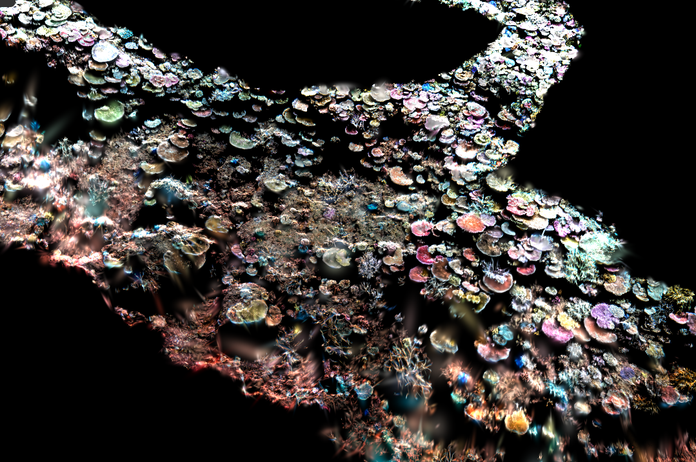

# ORCA seathru

A Python pipeline of **Sea-thru** — the physically based underwater
colour-restoration method from:

> Derya Akkaynak and Tali Treibitz, **"Sea-thru: A Method for Removing Water
> From Underwater Images,"** *IEEE/CVF Conference on Computer Vision and
> Pattern Recognition (CVPR), 2019, pp. 1682–1691.*
> [Paper (CVF Open Access, PDF)](https://openaccess.thecvf.com/content_CVPR_2019/papers/Akkaynak_Sea-Thru_A_Method_for_Removing_Water_From_Underwater_Images_CVPR_2019_paper.pdf) ·
> [Project page](http://csms.haifa.ac.il/profiles/tTreibitz/webpage/sea-thru.html)




*A 2,022-image GoPro survey from an autonomous surface vehicle, turned into a
single water-free, georeferenced 3 mm orthomosaic (~20 × 20 m of reef,
EPSG:32755) — every step below, no manual editing.*

This is an independent, from-scratch re-implementation of the paper's
equations plus a set of documented extensions for **downward-looking survey
imagery** (AUV/ASV reef mapping). All credit for the method and physics
belongs to Akkaynak and Treibitz — please cite their paper
(see [Citing](#citing)) if you use this software. It recovers water-free
colour from an RGB image **plus a per-pixel range map**, using the paper's
revised image-formation model (distinct backscatter and direct-signal
attenuation coefficients, range-dependent attenuation).

## Contents

- [ORCA seathru](#orca-seathru)
  - [Contents](#contents)
  - [Install](#install)
    - [1. The Python library](#1-the-python-library)
    - [2. COLMAP with CUDA](#2-colmap-with-cuda)
  - [The pipeline: GoPro images + CSV → orthomosaic](#the-pipeline-gopro-images--csv--orthomosaic)
    - [Step 0 — What you need](#step-0--what-you-need)
    - [Step 1 — Prepare the COLMAP workspace](#step-1--prepare-the-colmap-workspace)
    - [Step 2 — Sparse reconstruction](#step-2--sparse-reconstruction)
    - [Step 3 — Georegister to metres](#step-3--georegister-to-metres)
    - [Step 4 — Dense metric depth](#step-4--dense-metric-depth)
    - [Step 5 — Sanity-check and tune on samples](#step-5--sanity-check-and-tune-on-samples)
    - [Step 6 — Sea-thru colour correction](#step-6--sea-thru-colour-correction)
    - [Step 7 — Build the orthomosaic](#step-7--build-the-orthomosaic)
    - [Where next: Gaussian splats](#where-next-gaussian-splats)
    - [Time budget](#time-budget)
  - [Improvements over the original Sea-thru](#improvements-over-the-original-sea-thru)
  - [Survey-locked mode](#survey-locked-mode)
  - [Configuration / tunable parameters](#configuration--tunable-parameters)
  - [Other depth sources](#other-depth-sources)
  - [Large datasets (10k+ images)](#large-datasets-10k-images)
  - [Tuning tools](#tuning-tools)
  - [How it maps to the paper](#how-it-maps-to-the-paper)
  - [Deviations from the paper (documented)](#deviations-from-the-paper-documented)
  - [Limitations](#limitations)
  - [Citing](#citing)
  - [License](#license)
  - [Want to Support Me](#want-to-support-me)

## Install

Verified end-to-end on Ubuntu 24.04 (Ryzen 7 5800H, 32 GB RAM, RTX 3050
4 GB). The full annotated walk-through, including every gotcha we hit, is in
[docs/ubuntu_seathru_colmap_guide.md](docs/ubuntu_seathru_colmap_guide.md).

### 1. The Python library

Python 3.9–3.12 (3.12 recommended — the monocular depth patching needs
PyTorch, which has no wheels for newer interpreters yet).

```bash
git clone https://github.com/roboticsmick/ORCA_seathru.git
cd ORCA_seathru

python3 -m venv venv && source venv/bin/activate
pip install --upgrade pip
pip install -e ".[debug]"          # core + matplotlib for --debug montages

# monocular depth patching for COLMAP holes (--colmap-fill-mono, recommended):
pip install torch torchvision --index-url https://download.pytorch.org/whl/cu121
pip install timm opencv-python-headless

# orthomosaic output (GeoTIFF):
pip install rasterio pyproj

python -m seathru.cli --help       # sanity check
```

> Put the venv on a fast local ext4 drive, not NTFS/OneDrive — and the same
> goes for every COLMAP workspace below. SQLite + network/NTFS mounts corrupt
> silently.

### 2. COLMAP with CUDA

**The Ubuntu `apt install colmap` package is built without CUDA** — sparse
SfM works, but `patch_match_stereo` (the dense metric depth Sea-thru needs)
refuses to run. Build 3.9.1 from source (same version as apt, so every flag
in these docs matches):

```bash
sudo apt update && sudo apt install -y \
    nvidia-cuda-toolkit gcc-12 g++-12 \
    git cmake ninja-build build-essential ccache \
    libboost-program-options-dev libboost-graph-dev libboost-system-dev \
    libeigen3-dev libflann-dev libfreeimage-dev libmetis-dev \
    libgoogle-glog-dev libgtest-dev libsqlite3-dev libglew-dev \
    qtbase5-dev libqt5opengl5-dev libcgal-dev libceres-dev

mkdir -p colmap && cd colmap
wget http://archive.ubuntu.com/ubuntu/pool/universe/c/colmap/colmap_3.9.1.orig.tar.gz
tar xzf colmap_3.9.1.orig.tar.gz && mv colmap-3.9.1 src

# REQUIRED patch for GCC 13 ("'unique_ptr' is not a member of 'std'"):
wget http://archive.ubuntu.com/ubuntu/pool/universe/c/colmap/colmap_3.9.1-2build2.debian.tar.xz
tar xJf colmap_3.9.1-2build2.debian.tar.xz
(cd src && patch -p1 < ../debian/patches/gh-pr-2338)

mkdir build && cd build
cmake ../src -GNinja -DCMAKE_BUILD_TYPE=Release \
    -DCMAKE_CUDA_ARCHITECTURES=86 \
    -DCMAKE_CUDA_HOST_COMPILER=/usr/bin/g++-12 \
    -DCMAKE_INSTALL_PREFIX="$(pwd)/../install"
ninja && ninja install
mkdir -p ~/.local/bin && ln -sf "$(pwd)/../install/bin/colmap" ~/.local/bin/colmap

colmap -h | head -2        # must say "... with CUDA"
```

Notes: `gcc-12` because Ubuntu 24.04's nvcc (CUDA 12.0) rejects the default
GCC 13; `86` is the compute capability for RTX 30-series — find yours with
`nvidia-smi --query-gpu=compute_cap --format=csv,noheader` and drop the dot.
A driver reporting a newer CUDA than 12.0 is fine.

## The pipeline: GoPro images + CSV → orthomosaic

```text
images + processed_images.csv
      │
      ▼
COLMAP: GPS-pair matching → sparse poses → georegister (metres) → dense depth
      │
      ▼
depth hygiene: outlier clips + erosion trust filter + MONOCULAR hole patching
      │
      ▼
Sea-thru: survey-locked, water-column illuminant → water-free images
      │
      ▼
true-orthomosaic: fused DSM + most-nadir rendering → GeoTIFF (QGIS-ready)
```

Every command below is copy-paste runnable with three variables:

```bash
export REPO=/path/to/ORCA_seathru     # this repository
export T=/path/to/my_survey           # dataset root
export PATH="$HOME/.local/bin:$PATH"  # for the local COLMAP install
```

### Step 0 — What you need

```text
my_survey/
├── images/                  # the GoPro JPEGs
└── processed_images.csv     # one row per image:
                             # image_name,image_path,timestamp_utc,
                             # latitude,longitude,heading_deg,depth_m
```

- **Building the CSV from AUV/ASV telemetry:**
  [docs/prepare_photogrammetry_set.py](docs/prepare_photogrammetry_set.py)
  matches image EXIF capture times (UTC) against a mission telemetry log,
  interpolates lat/lon/heading/depth per image, and crops the transit to/from
  the survey site.
- **Trial run on a patch first:**
  [docs/make_test_subset.py](docs/make_test_subset.py) cuts a self-contained
  mini-survey (all images within N metres of a seed image) that runs the whole
  pipeline in hours instead of days. Strongly recommended before a full
  survey.
- `depth_m` may be `-1` everywhere; only lat/lon are required (they set the
  metric scale). Heading is **not** required for a downward camera.

### Step 1 — Prepare the COLMAP workspace

```bash
mkdir -p $T/colmap/logs

# machine-tuned knobs (threads, image sizes, cache) -> pipeline.env
python $REPO/scripts/hw_profile.py --out $T/colmap/pipeline.env

# CSV -> georegistration reference (local ENU metres) + capture-order list
python $REPO/scripts/colmap_geo_from_csv.py --csv $T/processed_images.csv --out-dir $T/colmap

# CSV -> GPS/time neighbour pairs (THE trick that bounds matching cost)
python $REPO/scripts/colmap_make_pairs.py --csv $T/processed_images.csv \
    --out $T/colmap/pairs.txt --seq 10 --radius 2.0 --max-neighbors 40
```

**Do not use `exhaustive_matcher` above ~500 images** — 2,000 images is
already ~2 M pairs. GPS-pair matching cut our test survey to 53 k pairs
(~50/image) with no loss of reconstruction quality. Set `--radius` to about
2–3× your survey line spacing.

### Step 2 — Sparse reconstruction

```bash
cd $T/colmap && source pipeline.env

colmap feature_extractor \
    --database_path database.db --image_path ../images \
    --ImageReader.single_camera 1 --ImageReader.camera_model OPENCV \
    --SiftExtraction.max_image_size "$MAX_IMAGE_SIZE" \
    --SiftExtraction.max_num_features "$MAX_NUM_FEATURES" \
    --SiftExtraction.use_gpu "$USE_GPU"

colmap matches_importer \
    --database_path database.db --match_list_path pairs.txt \
    --match_type pairs --SiftMatching.use_gpu "$USE_GPU"

colmap mapper \
    --database_path database.db --image_path ../images --output_path sparse \
    --Mapper.num_threads "$COLMAP_THREADS" \
    --Mapper.ba_global_function_tolerance 1e-5
```

All three stages are resumable (re-running skips finished work). The mapper
is the long CPU stage. Reference numbers for 2,022 images on a laptop:
extraction 7 min (GPU), matching 1 h 45 (GPU), mapping 5 h 15 (CPU) —
**1,939/2,022 registered, 1.3 px mean reprojection error**. For 10k+ image
surveys see [Large datasets](#large-datasets-10k-images).

### Step 3 — Georegister to metres

Sea-thru's physics assume **metres**, so this step is not optional — and
COLMAP's own `model_aligner` **fails on flat downward surveys** (the camera
centres are nearly coplanar, so its RANSAC returns mirror-flipped models at
the wrong scale). Use the robust planar georegistration script instead:

```bash
colmap model_converter --input_path sparse/0 \
    --output_path /tmp/sparse_txt --output_type TXT

python $REPO/scripts/colmap_georef_planar.py \
    --model-txt /tmp/sparse_txt \
    --geo-ref geo_ref.txt \
    --out geo_sim3.txt \
    --csv ../processed_images.csv     # cross-checks scale vs sonar depth_m

colmap model_transformer --input_path sparse/0 \
    --output_path sparse_geo --transform_path geo_sim3.txt
```

The script prints the fitted scale, the horizontal residual vs GPS, the model
extent, and **refuses to write a flipped model** (seabed above cameras).
Check the printed extent matches your real survey size — a wrong scale here
silently poisons every downstream product.

### Step 4 — Dense metric depth

```bash
colmap image_undistorter \
    --image_path ../images --input_path sparse_geo \
    --output_path dense --output_type COLMAP \
    --max_image_size "$DENSE_MAX_IMAGE_SIZE"

colmap patch_match_stereo \
    --workspace_path dense --workspace_format COLMAP \
    --PatchMatchStereo.gpu_index "$GPU_INDEX" \
    --PatchMatchStereo.max_image_size 1000 \
    --PatchMatchStereo.geom_consistency 0 \
    --PatchMatchStereo.cache_size "$PMS_CACHE_GB"
```

This is the pipeline's long pole (~15 h for 2,000 images on a 4 GB GPU) but
it is resumable and the settings matter:

- **`geom_consistency 0` + 1000 px halves-to-quarters the runtime** with no
  visible cost to the colour correction: Sea-thru estimates its model at
  1024 px and fits smooth per-survey statistics, so single-pass photometric
  depth is quality-neutral for it. (Compute the geometric pass later only if
  you want `stereo_fusion` meshes.)
- **Disk:** budget ~40 GB per 2,000 images; the `normal_maps/` folder is ~3×
  the depth maps and only needed by `stereo_fusion` — deletable afterwards.
- **Don't run other heavy jobs alongside it** — the PatchMatch cache holds
  `PMS_CACHE_GB` of system RAM for the whole run.

The holes that MVS inevitably leaves (motion blur, fish, texture-poor sand)
are handled automatically at correction time — see the depth-hygiene flags in
Step 6, including **monocular neural patching** aligned to each frame's own
valid depth.

### Step 5 — Sanity-check and tune on samples

A full-survey run is hours; a sample check is minutes. **Never skip this.**

```bash
python $REPO/scripts/seathru_qc_variants.py \
    --input-dir $T/colmap/dense/images \
    --colmap-workspace $T/colmap/dense --colmap-depth-kind photometric \
    --csv $T/processed_images.csv \
    --out-dir $T/seathru_qc --n 6
```

This picks frames that **span the survey's depth range** (the frames that
expose range-dependent failures), runs named parameter variants, writes
contact sheets, and reports a quantitative *depth-consistency* score (deep vs
shallow red/blue ratio — 1.0 means the deep zone is as water-free as the
shallow zone). It also reports what fraction of the survey has raw red below
the sensor noise floor — colour that no method can recover (see
[Limitations](#limitations)). Judge the sheets **per-frame, not on
averages**, and tune `--f` (exposure), `--saturation`, and `--l` here. See
[Tuning tools](#tuning-tools) for the single-knob and two-knob sweepers.

### Step 6 — Sea-thru colour correction

The full validated recipe for a downward reef/seabed survey:

```bash
python -m seathru.cli \
    --input-dir $T/colmap/dense/images \
    --out-dir   $T/seathru_out \
    --csv       $T/processed_images.csv \
    --depth colmap --colmap-workspace $T/colmap/dense \
    --colmap-depth-kind photometric \
    --colmap-clip-low 2.0 --colmap-fill-holes 0.02 --colmap-fill-border \
    --colmap-fill-mono \
    --attenuation-mode coarse --illuminant-mode water-column \
    --l 1.0 --f 2.4 --saturation 1.6 --full-res \
    --survey-locked --lock-exposure --no-lock-backscatter --calib-sample-size 20
```

What the flag groups do (details in
[Improvements](#improvements-over-the-original-sea-thru)):

- **Depth hygiene** (`--colmap-clip-low / fill-holes / fill-border /
  fill-mono`): percentile-clips MVS outliers, deletes untrustworthy noise
  blobs (erosion trust filter, automatic), fills interior holes by
  interpolation, and patches everything else with **MiDaS monocular depth
  aligned per-image to the frame's own valid COLMAP pixels** — no training
  needed, ~1 s/frame on GPU.
- **Nadir-survey physics** (`--attenuation-mode coarse --illuminant-mode
  water-column`): the paper's defaults are built for horizontal imaging and
  leave the deep parts of a downward survey blue; these two switches fix the
  attenuation-vs-range direction and remove local scene-colour bias.
- **Look** (`--f 2.4 --saturation 1.6`): exposure (higher f = darker output,
  more highlight detail) and post-recovery chroma. Tune on your own samples
  in Step 5.
- **Survey consistency** (`--survey-locked --lock-exposure
  --no-lock-backscatter`): one radiometric calibration for the whole survey —
  this is what makes orthomosaic strips join invisibly and stops splat colour
  flicker. Backscatter stays per-image on purpose (it is range-dependent).

Runtime ~7 s/image full-res (≈4 h for 2,000). Every frame logs which
processing path it took, and the run ends with a **processing-path summary**
— read it before trusting the output. The healthy signature is every frame on
`illum: wc-locked-slope` + `mono-filled`; any `FALLBACK`/`FAILED` entries
deserve a look.

Reference result on the 2,022-image test survey: deep-zone red/blue **0.96**
(1.0 = fully water-free), **0** frames with residual deep water, **0**
over-corrected, survey-wide mean-luminance spread **0.027**.

If a downstream tool looks images up by their COLMAP names (3DGS loaders,
photogrammetry suites), rename the outputs — PNG bytes under a `.JPG` name
are fine, loaders sniff content:

```bash
cd $T/seathru_out
for f in *_seathru.png; do mv "$f" "${f%_seathru.png}.JPG"; done
```

### Step 7 — Build the orthomosaic

```bash
python $REPO/scripts/build_orthomosaic.py \
    --corrected-dir $T/seathru_out \
    --colmap-workspace $T/colmap/dense \
    --csv $T/processed_images.csv \
    --out $T/orthomosaic.tif \
    --gsd 0.003
```

Two-pass **true-orthorectification**, ~10 minutes for 2,000 frames on one CPU
core with <1.5 GB RAM:

1. fuse **one DSM** from every frame's depth map (2 cm cells, hole-filled,
   median-filtered);
2. render every ground cell from its **most-nadir camera** through that
   common surface — one source image per region.

The common surface + single-source rendering is what prevents *ghosted double
corals*: per-frame depth noise displaces projected pixels laterally, and any
compositing that interleaves frames per-cell prints that as double vision.
Here it collapses into Voronoi seams that survey-locked colour makes
invisible. (A naive splatting mode is kept as `--mode zbuffer` for
comparison.) Pick `--gsd` near your imagery's native footprint
(`altitude / focal-length-in-px`, ~2.5 mm for a GoPro at 1.7 m); use
`--subsample 4 --pixel-stride 2 --gsd 0.01` for a 3-minute preview.

The output GeoTIFF is tiled, compressed, alpha-masked, and carries its CRS
(UTM zone auto-detected from the CSV) — drop it straight into QGIS.

### Where next: Gaussian splats

The corrected images + COLMAP model are exactly the input a water-free
Gaussian splat needs. Training on **pre-corrected** images attacks the
floater problem at the source: joint methods (e.g. SeaSplat) spend their
first ~10k iterations fitting raw hazy images, so the optimizer explains
backscatter by placing semi-transparent Gaussians in the water column —
whereas water-free images from iteration 0 give those floaters nothing to
explain.

That pipeline — chunked training with depth-L1 supervision from the same
hygiene-filtered depth maps, seafloor cropping against the orthomosaic DSM,
and merging back to a single `.ply` — lives in its own repository,
[ORCA_splat](https://github.com/roboticsmick/ORCA_splat), which pulls this
repo and COLMAP in as submodules. Kept separate because the splat trainer is
a fork of SeaSplat/Inria 3DGS under a non-commercial research licence, which
must not mix into this MIT tree.

### Time budget

Reference wall-clock, 2,022 images (5568×4872 GoPro), Ryzen 5800H + RTX 3050:

| Stage | Time |
| --- | --- |
| COLMAP build (once) | ~15 min |
| Feature extraction + GPS-pair matching (GPU) | ~2 h |
| Sparse mapping (CPU) | ~5 h |
| Georegistration | seconds |
| Dense depth, 1000 px photometric (GPU) | ~15 h |
| QC + tuning on samples | minutes |
| Sea-thru correction, full-res survey-locked | ~4 h |
| Orthomosaic (3 mm GeoTIFF) | ~10 min |

Budget about a day end-to-end, dominated by dense depth. Everything long is
resumable and bounded in RAM by design.

## Improvements over the original Sea-thru

Everything here is an addition or correction relative to the 2019 paper and
its reference implementations, each motivated by a failure observed on a real
2,022-image reef survey (1.5–5.6 m depth) and validated on it. The metric
quoted is *depth consistency*: recovered red/blue in each frame's deepest 15%
of pixels vs its shallowest 25% (1.0 = deep as water-free as shallow),
measured only where raw red is above the sensor noise floor.


**1. Coarse attenuation mode for nadir imagery** (`--attenuation-mode
coarse`). The paper's Eq. 11 fits β_D(z) as a sum of *decaying* exponentials
— correct for horizontal imaging, where every object sits at the same depth.
Looking straight down, range ≈ depth, deeper pixels sit under redder-depleted
light, and true β_D *rises* with range; the decaying fit produces a
physically impossible decreasing optical depth and leaves the deep half of
every drop-off frame blue. Using the paper's own Eq. 12 coarse estimate
directly restores the correct behaviour. *Depth consistency 0.23 → 0.79.*

**2. Water-column illuminant** (`--illuminant-mode water-column`). The
paper's local space-average illuminant embeds a local gray-world assumption;
where the seabed is genuinely coloured (deep algae rubble), the correction
paints the zone with the complementary cast — and the error grows
exponentially with depth (deep yellow corals render red, measured +0.11/m
red/green drift). Fitting the illuminant as a per-channel exponential in
range, `E_c(z) = exp(a_c + b_c·z)`, makes the correction a function of the
water column rather than local scene colour: objects at the same range get
identical treatment and natural shading survives. *Drift +0.11 → ≈0.0 /m;
best colour fidelity of every variant in blind review:*


**3. Mixed-effects survey calibration** (survey-locked mode, not in the
paper). White-balance gains, exposure bounds, and the water-column **slope**
are frozen from a pooled within-frame (fixed-effects) fit across calibration
frames — while the **backscatter** fit and the illuminant **intercept** stay
per-frame (backscatter is range-dependent; the intercept absorbs camera
auto-exposure/AWB drift). Two estimator details proved essential: the
intercept anchors to the *direct signal* `I − B` (the local illuminant's
scale is chaotic on flat frames — two near-identical frames differed 2.2×,
one blown white) and aggregates as a *pixel-weighted* median (per-depth-bin
medians span ~7× within one frame because bright coral tops sit shallow and
dark crevices deep). *Result: survey-wide mean-luminance spread of 0.027 and
neighbouring frames indistinguishable —*


**4. MVS depth hygiene + monocular hole patching** (`--colmap-clip-low`,
erosion trust filter, `--colmap-fill-holes`, `--colmap-fill-border`,
`--colmap-fill-mono`). Real `patch_match_stereo` output contains near-camera
junk (which explodes β = −ln E / z), noise blobs inside failed zones
(attached to the valid region by thin bridges — naive nearest-fill propagates
them, producing saturated false-colour bands), and large holes whose true
surface is no continuation of the rim. The fix stack: percentile clips →
erode-and-trust filtering → interior interpolation → **MiDaS relative depth
aligned per-image to the frame's own ~90% valid metric pixels** (robust
affine fit in inverse depth; the survey supervises itself, no training).
Median alignment residual on the worst frame: **0.10 m**, artefact
eliminated:


**5. True-orthorectification from the pipeline's own depth**
(`scripts/build_orthomosaic.py`). No second photogrammetry run: fuse one DSM
from all depth maps, render each cell from its most-nadir camera, write a
UTM GeoTIFF. Kills the ghosting that per-pixel splatting produces from
per-frame depth noise.

**6. Operational instruments** (also not in the paper): the depth-spanning
QC harness with its depth-consistency metric, a noise-floor recoverability
scan (know what fraction of your survey is physically unrecoverable *before*
a run), and a per-frame processing-path audit with an end-of-run summary so
silent fallbacks are visible instead of surfacing as odd-looking frames.
Cosmetic and declared as such: `--saturation`, a uniform post-recovery chroma
gain.

Further evidence figures live in [docs/images/](docs/images/)
(`whitepair_before.png`, `monofill_redband_diagnosis.png`,
`bluecheck_G0018489.png`, `filllevels_G0018489.png`).

## Survey-locked mode

Per-image adaptive fitting (the paper's behaviour, and this library's
default) re-estimates backscatter, illuminant, attenuation, and white balance
for every frame — ideal for single images, but on a survey the frame-to-frame
drift becomes orthomosaic seams and view-dependent splat colour flicker.
`--survey-locked` calibrates once from a sample (`--calib-sample-size`,
evenly spread over the survey), saves the statistics to
`<out-dir>/survey_stats.json`, and reuses them for every frame.

- `--lock-exposure` also freezes the contrast-stretch bounds (recommended for
  any multi-view product).
- `--no-lock-backscatter` keeps the backscatter fit per-image — **required on
  depth-varying surveys**: backscatter is intrinsically range-dependent, and
  freezing one median fit re-introduces haze on the deep frames.
- If a stats file already exists it is **loaded, not recalibrated** — delete
  it (or use a fresh out-dir) after changing parameters.
- Bonus: locked mode is ~2× faster per image (skips the nonlinear re-fits).

## Configuration / tunable parameters

All knobs live in `seathru.core.SeathruParams` (mirrored 1:1 by CLI flags).
Summary of the ones that matter most:

| Param | CLI flag | Default | Effect |
| --- | --- | --- | --- |
| `l` | `--l` | `1.0` | Range-correction strength. With `coarse` mode keep 1.0 — lowering it starves the deep correction; raising past ~1.15 tips deep pixels pink. |
| `f` | `--f` | `2.0` | **Exposure dial** (water-column mode): how far above scene radiance the model illuminant sits, i.e. how much signal saturates pre-clip. Higher = darker output, more highlight detail. `2.4` ≈ 10% blown highlights on the test reef. Not cancelled by recalibration. |
| `saturation` | `--saturation` | `1.0` | Post-recovery chroma gain (cosmetic). `1.4–1.6` restores the punch that physically-correct removal flattens; uniform, survey-consistent. |
| `attenuation_mode` | `--attenuation-mode` | `two-term` | `two-term` = paper Eq. 11 (horizontal imaging). `coarse` = Eq. 12 direct; **required for downward surveys**. |
| `illuminant_mode` | `--illuminant-mode` | `local` | `local` = paper Eq. 14. `water-column` = exponential-in-range model; preserves relative object colour on downward surveys. |
| `p`, `epsilon` | `--p`, `--epsilon` | `0.5`, `0.05` | Illuminant locality / iso-range band width (paper §4.4). Rarely need touching. |
| `protect_red` | `--no-protect-red` | on | Gentle red white-balance (avoids pink cast on red-starved frames). |
| `stretch_pct` | `--stretch-low/high` | `0.5, 99.5` | Output contrast-stretch percentiles. |
| — | `--colmap-clip-low` | `2.0` | Drop the lowest N% of each depth map (near-camera MVS junk). |
| — | `--colmap-fill-holes` | `0.02` | Fill interior depth holes up to this fraction of image area. |
| — | `--colmap-fill-border` | off | Extrapolate border-touching gaps (use when every pixel must be corrected). |
| — | `--colmap-fill-mono` | off | MiDaS patching of remaining holes (recommended; needs torch). |
| `hue_depth_flatten` | `--hue-depth-flatten` | `0.0` | Experimental depth-hue de-drift; superseded by `water-column` mode. |

`p`/`f`/`l`/`epsilon` only act with a spatially varying range map; on a flat
plane only the stretch and white balance are active.

## Other depth sources

The range map is a pluggable input (`seathru.depth`) — COLMAP is the best
path, but not the only one:

| Source | Class / flag | Notes |
| --- | --- | --- |
| COLMAP dense | `--depth colmap` | metric; this README's pipeline |
| Other SfM (Metashape/ODM exports) | `--depth file` | per-image `.npy/.tif/.png` + `--depth-scale` |
| Monocular network only | `--depth mono` | approximate; scale anchored to CSV `depth_m` |
| Image-derived prior | `--depth estimated` | no torch/SfM needed; fine for previews/tuning |
| Flat plane | `--depth plane` | backscatter + white balance only |

## Large datasets (10k+ images)

The pipeline holds; only the sparse **mapping** stage needs care (it is the
one stage that isn't per-image). Options, laptop-friendliest first:

- **Chunked mapping** — split the capture-order list into overlapping windows
  (`scripts/colmap_make_chunks.py`, e.g. 900 frames with 17% overlap), run
  `colmap mapper --image_list_path chunk_k.txt` per chunk, then
  `colmap model_merger` pairwise + one final `bundle_adjuster`. Each chunk is
  a bounded evening-sized job, and a `[ -d "$out/0" ] && continue` guard makes
  the loop resume-safe across power-offs.
- **`hierarchical_mapper`** — one long self-partitioning run; resume a crash
  with `mapper --input_path sparse/0 --output_path sparse/0`.
- **Decimate** for the SfM only (`awk 'NR%2==1'` on the image list): poses
  interpolate fine at high overlap, and Sea-thru still corrects *every*
  image.
- **HPC**: chunked mapping is embarrassingly parallel — one SLURM array task
  per chunk, extraction/matching/dense as single GPU jobs before/after.

Everything else (extraction, matching, dense depth, Sea-thru, orthomosaic)
already streams per-image with bounded RAM and skips completed work on
re-run. Keep `database.db` and all outputs on ext4 — never NTFS or synced
folders.

## Tuning tools

All of these run against real COLMAP depth (`--depth colmap`):

```bash
# every parameter isolated, one row per knob, on N sample images
python scripts/param_effect_grid.py --input-dir ... --csv ... --out-dir ... --n 10

# two knobs against each other on one scene (e.g. f vs saturation)
python scripts/param_grid_2d.py --input-dir $T/colmap/dense/images --csv ... \
    --image G0020060.JPG --depth colmap --colmap-workspace $T/colmap/dense \
    --x-param f --x-values 2.0,2.4,2.8 --y-param saturation --y-values 1.2,1.6

# named variants over depth-spanning frames + quantitative QC (Step 5)
python scripts/seathru_qc_variants.py ...
```

Tune on frames that span your depth range — a knob that looks right on a
shallow frame can be wrong at depth (that mistake is how we learned most of
what's in the [Improvements](#improvements-over-the-original-sea-thru)
section).

## How it maps to the paper

| Paper | Here |
| --- | --- |
| Eq. 8 recovery `J = (I−B)·e^{β_D z}` | `seathru.core.recover_image` |
| Eq. 9 white balance | `_compute_wb_gains` / `_apply_wb_gains` |
| Eq. 10 backscatter (dark-pixel fit) | `find_backscatter_points`, `estimate_backscatter` |
| Eq. 11 two-term β_D(z) fit | `refine_attenuation` (`--attenuation-mode two-term`) |
| Eq. 12 coarse β_D | `coarse_attenuation` (`--attenuation-mode coarse`) |
| Eq. 14 local space-average illuminant | `estimate_illumination` |
| Eq. 15 iso-range neighbourhoods | `construct_neighborhood_map` |

## Deviations from the paper (documented)

- **Inputs are 8-bit sRGB JPEG**, inverse-gamma'd to approximate linear
  radiance (the paper uses linear RAW; a RAW path is stubbed in `io_images`).
- **Illuminant** uses the fast neighbourhood-mean form of local space average
  colour rather than the full per-pixel iterative diffusion.
- Photofinishing (§4.5) is out of scope; output is display-ready sRGB PNG.
- Everything in [Improvements](#improvements-over-the-original-sea-thru) is
  an intentional, opt-in extension — the defaults
  (`two-term` + `local` + per-image adaptive) reproduce the published method.

## Limitations

- **The sensor noise floor is a hard physical limit.** Where raw red recorded
  ≈0 (deep/turbid water), there is nothing to amplify: those pixels render
  neutral-cyan. ~8% of test-survey frames had a substantial such zone. The QC
  scan quantifies this per survey *before* you spend hours. Shooting RAW,
  slower exposures, or lights are the only real fixes.
- **One water body per survey** is assumed by the locked water-column model;
  strong turbidity gradients or long time spans need piecewise calibration.
- **Depth consistency is a proxy metric**, not ground truth — it assumes deep
  and shallow scene content have similar intrinsic colour statistics. In-water
  colour charts at multiple depths remain the gold standard.
- **Monocular hole patching inherits network biases** at object boundaries;
  the per-image alignment fixes global scale/shift, not local shape. Patched
  fractions are logged per frame.
- **Validated on one survey** (one site, one camera, 1.5–5.6 m). Replication
  on other sites/depths/cameras — and a horizontal-imaging control — is
  needed before stronger claims.

## Citing

If you use this software, please cite the original method:

```bibtex
@InProceedings{Akkaynak_2019_CVPR,
    author    = {Akkaynak, Derya and Treibitz, Tali},
    title     = {Sea-Thru: A Method for Removing Water From Underwater Images},
    booktitle = {Proceedings of the IEEE/CVF Conference on Computer Vision and
                 Pattern Recognition (CVPR)},
    month     = {June},
    year      = {2019},
    pages     = {1682-1691}
}
```

## License

MIT for the code in this repository. The Sea-thru method itself is the
intellectual work of Akkaynak & Treibitz — cite them.

## Want to Support Me

If you use this for your own work, and you're not a student, and you want to thank me, feel free to buy me a [ST-VIS-25 spectrometer](https://www.oceanoptics.com/spectrometer/st-vis/), or a [Headwall hyperspectral MV.C VNIR camera](https://www.automate.org/products/headwall-photonics/mv-c-vnir) or a [Specim FX10 Hyperspectral Camera](https://www.specim.com/products/specim-fx10/), or a [OAK 4 CS Global Shutter camera](https://shop.luxonis.com/products/oak-4-cs) so I can keep making cool ROS2 camera packages in my spare time ❤️
